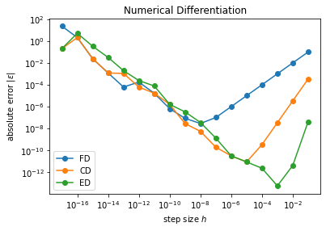

# Data Science Projects

### [Next day rain prediction in Australia - Machine learning Project](https://github.com/mehulg772/Mehul_portfolio/blob/main/Project_Codes/MachineLearningProject.ipynb)
* A model that predicts the likelihood of rain tomorrow. All processes of data cleaning, EDA, and applying algorithms are included. 

### [Stock Prices of Banks](https://github.com/mehulg772/Mehul_portfolio/blob/main/Project_Codes/FinanceProject%20(1).ipynb)
* Looking over various top bank stock prices, calculating returns, and plotting multiple seaborn graphs. 

### [Greenhouse Gas Emissions](https://github.com/mehulg772/Mehul_portfolio/blob/main/Project_Codes/DataScienceProject%20(5).ipynb)
* Mini project investigating UK government's commitment to reducing greenhouse gas emissions (GHG) to net-zero by 2050. Includes short summary of my findings and analysis with different plots.

## Scientific Computing

### [Markov Chain Monte Carlo (MCMC) Method](https://github.com/mehulg772/Mehul_portfolio/blob/main/Project_Codes/RandomWalk-MCMC-Fit.ipynb)
* A powerful model predicting any function's parameters or minimum points, curve fitting, and other potential uses in areas of statistical physics. 

### [Numerical Differentiation](https://github.com/mehulg772/Mehul_portfolio/blob/main/Project_Codes/Numerical-Diff.ipynb)
* Three methods of increasing sophistication to estimate the derivative of a mathematical function. Also looking into how to choose the parameters of these methods to get accurate results, testing algorithm and exploring errors.
 

### [Numerical Integration](https://github.com/mehulg772/Mehul_portfolio/blob/main/Project_Codes/Numerical-Int.ipynb)
* Numerical integration methods, starting with the simple Trapezoid and Simpson’s rules, and moving on to the more sophisticated *Gaussian quadrature*.

### [Matrices, Eigenvectors and Eigenvalues](https://github.com/mehulg772/Mehul_portfolio/blob/main/Project_Codes/EigenVecVal.ipynb)
* Exploring matrices and their eigenvectors and eigenvalues. Application to real-world case (ecology example), and solving one physics problem. 
